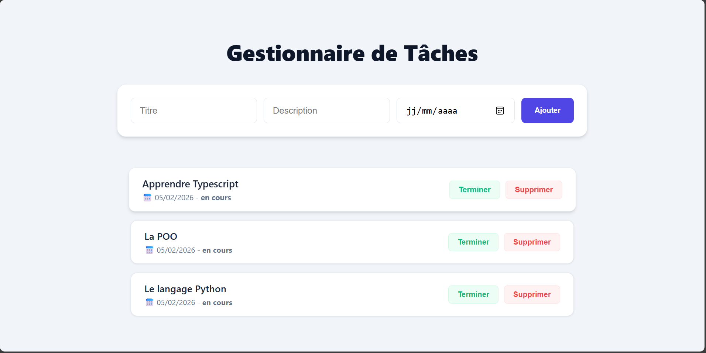

# ✅ Task Manager - To-Do List en TypeScript

## 📸 Aperçu de l'application

## 📌 Description

Ce projet est une application de gestion de tâches (**To-Do List**) développée en **TypeScript**.  
Elle permet à l’utilisateur de :

- Ajouter une tâche avec un titre, une description et une date limite  
- Supprimer une tâche  
- Marquer une tâche comme terminée  
- Trier et filtrer les tâches  
- Manipuler le DOM avec TypeScript

Ce projet est idéal pour pratiquer les concepts fondamentaux de TypeScript comme :

- Les types
- Les interfaces
- Les classes
- Les tableaux
- Les modules
- La programmation orientée objet
- Le DOM (version web)

---

## 🎯 Fonctionnalités

✅ Ajouter une tâche  
✅ Supprimer une tâche  
✅ Marquer une tâche comme terminée  
✅ Affichage dynamique dans une interface web  
✅ Tri des tâches par date  
✅ Filtrage par statut (*en cours / terminée*)  

---

## 🛠️ Technologies utilisées

- **TypeScript**
- **HTML5**
- **CSS3**
- **JavaScript ES6 Modules**

---

## 📂 Structure du projet
A voir sur le depot